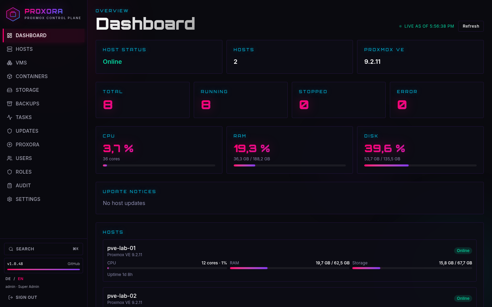
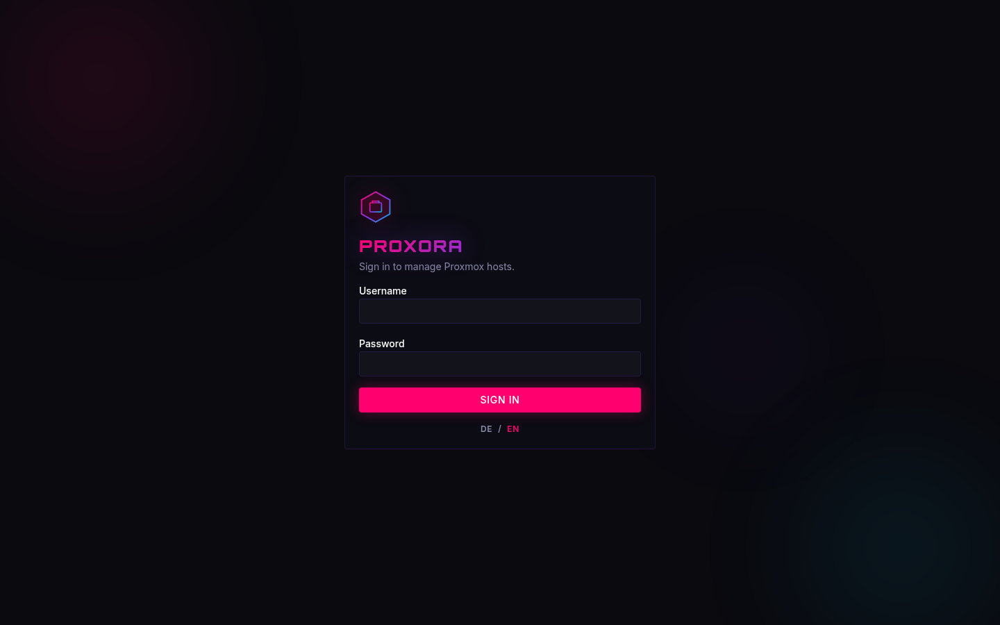
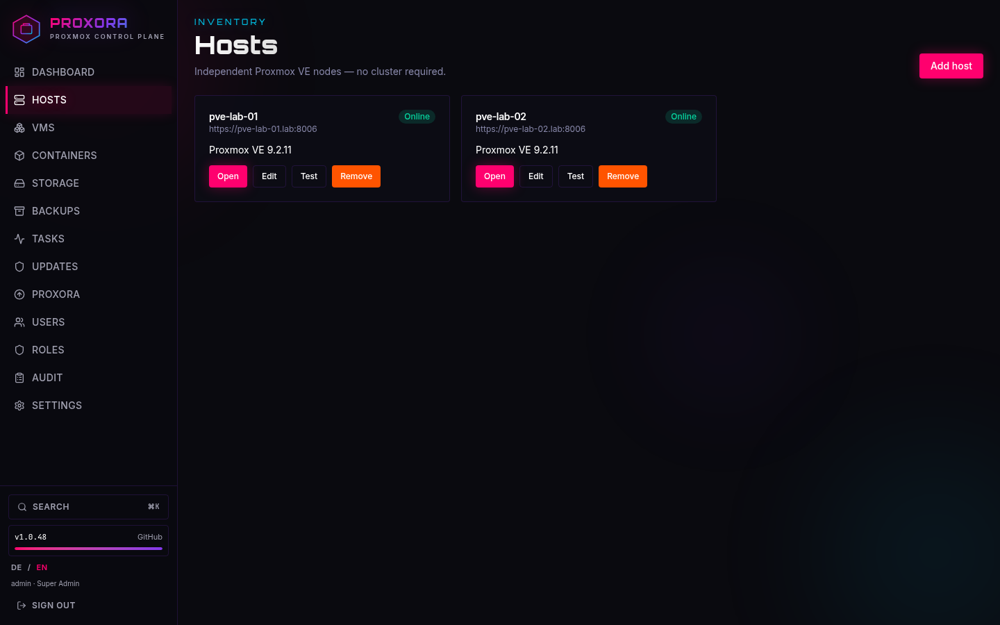
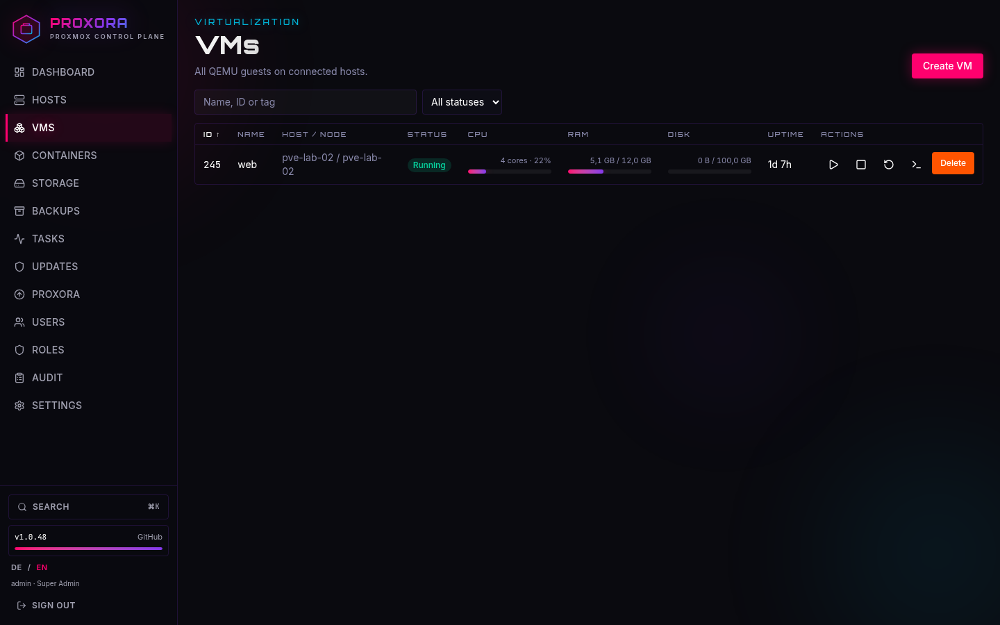
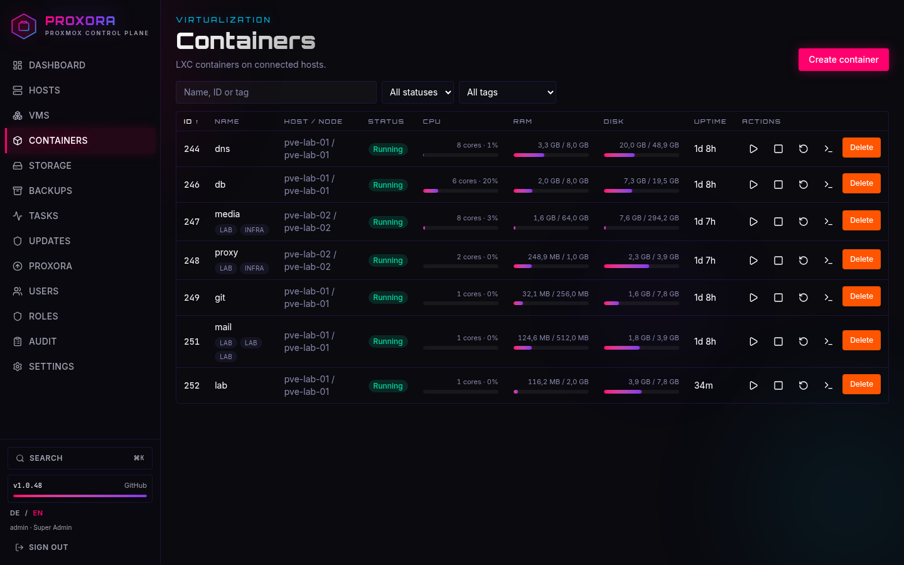
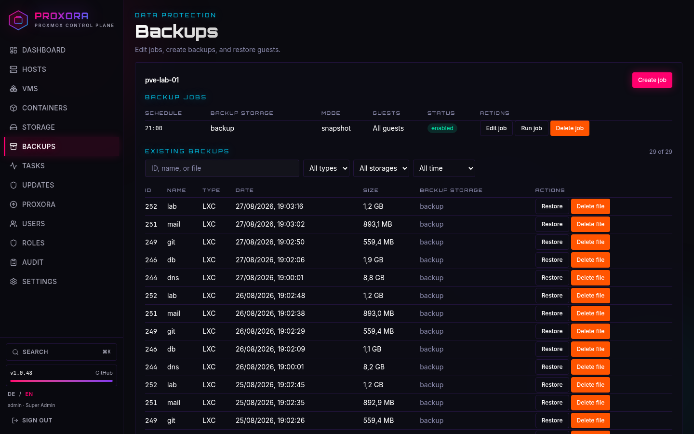
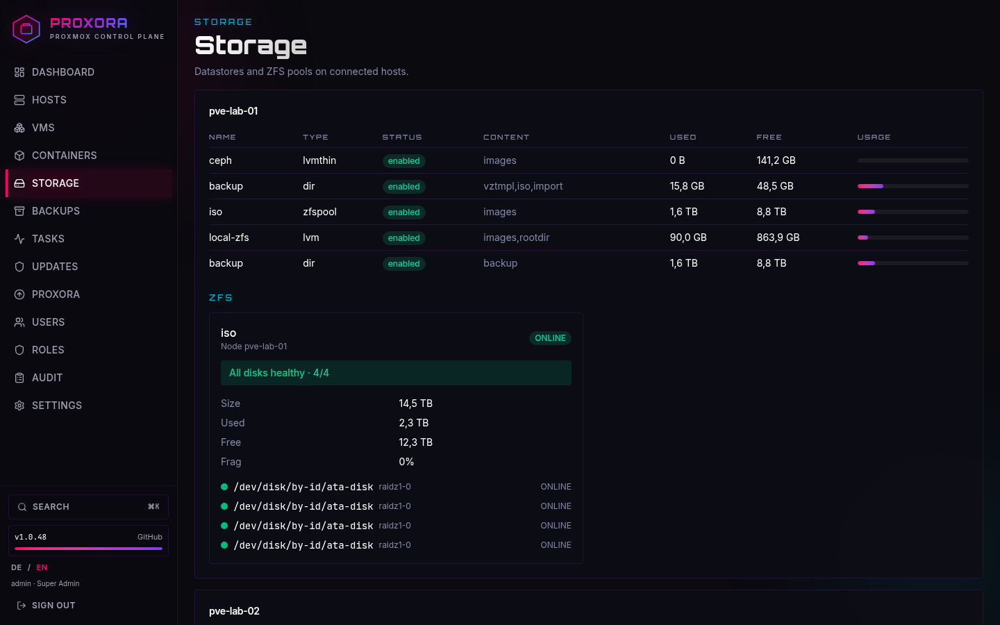

# Proxora

<p align="center">
  
</p>

**Proxmox management suite** for independent VE hosts — VMs, LXC, storage, ZFS, consoles, and GitHub self-updates.

[](https://github.com/MarcelRuh/proxora/actions/workflows/ci.yml)
[](https://github.com/MarcelRuh/proxora/releases/tag/stats)
[](https://github.com/MarcelRuh/proxora/tree/usage)
[](./LICENSE)

> Status: **v2.0.14** – self-hosted Proxmox control plane with an Android client.

Proxora talks to each node through the official **Proxmox VE API**. No cluster required.

## Screenshots

Host, guest, and disk identifiers in these shots are anonymized lab labels.

<p align="center">
  
</p>

<p align="center">
  
  &nbsp;
  
</p>

<p align="center">
  
  &nbsp;
  
</p>

<p align="center">
  
  &nbsp;
  
</p>

## One-line install (wget)

Requires Docker + Compose V2. Installs to `/opt/proxora` by default and generates strong secrets.

```bash
wget -qO- https://raw.githubusercontent.com/MarcelRuh/proxora/main/scripts/install.sh | bash
```

Custom directory:

```bash
wget -qO- https://raw.githubusercontent.com/MarcelRuh/proxora/main/scripts/install.sh | PROXORA_DIR=/srv/proxora bash
```

Or with curl:

```bash
curl -fsSL https://raw.githubusercontent.com/MarcelRuh/proxora/main/scripts/install.sh | bash
```

## Update

**In the UI (recommended):** Sidebar → **Proxora** → *Jetzt aktualisieren* (admin).

The dashboard and sidebar show `current → latest` plus a live progress bar while the stack rebuilds.

**CLI one-liner:**

```bash
wget -qO- https://raw.githubusercontent.com/MarcelRuh/proxora/main/scripts/update.sh | bash
```

Preserves `.env` and data volumes, syncs from GitHub, then runs `docker compose up -d --build`.

Installs and running copies send an anonymous ping to the GitHub `stats` prerelease (a dummy file download, no IDs). Totals: [wget installs](https://github.com/MarcelRuh/proxora/releases/tag/stats) · [active ~7 days](https://github.com/MarcelRuh/proxora/tree/usage). Opt out with `PROXORA_TELEMETRY=0`.

## Features

- Multi-host inventory (standalone or clustered nodes, treated independently)
- Live dashboard (CPU/RAM/disk, VM/LXC counts, activity)
- QEMU + LXC lifecycle, snapshots, clone, config, create wizards
- Backup jobs, run-now, restore, and backup file delete
- xterm.js consoles (VM serial, LXC, node shell) via a credential-safe WebSocket proxy
- SFTP file panel on guests (browse, edit, upload, download) via SSH to the guest IP
- Guest file explorer: QEMU agent on VMs (no SSH), SFTP fallback / LXC
- Storage overview including ZFS pool health
- Proxmox APT updates with a job queue
- Users, roles, per-action RBAC, optional per-host and per-VM allow-lists
- Optional TOTP 2FA at sign-in
- Append-only audit log, global search (`Ctrl+K`)
- Dark neon UI (Dockora-inspired)
- **Android app** (`android/`) — full UI in a WebView against your instance
- **In-app self-update** from GitHub with version + progress bar (sidecar owns `docker.sock`)

## Stack

| Layer | Tech |
|-------|------|
| App | Next.js 16, React 19, TypeScript, Tailwind CSS |
| API | Route handlers + Prisma/PostgreSQL |
| Console | xterm.js + WebSocket termproxy |
| Android | Kotlin WebView client (`android/`) |
| Runtime | Docker Compose |

## Quick start (development)

**Requirements:** Node.js 22+, PostgreSQL 16

```bash
cp .env.example .env
npm install
npx prisma migrate dev
npx prisma db seed
npm run dev
```

| Service | URL |
|---------|-----|
| Web | http://localhost:3000 |

Sign in with the bootstrap admin (`BOOTSTRAP_ADMIN_*` in `.env`) and **change the password immediately**.

## Production (Docker Compose)

```bash
git clone https://github.com/MarcelRuh/proxora.git
cd proxora
cp .env.example .env
# Set ENCRYPTION_KEY, SESSION_SECRET, BOOTSTRAP_ADMIN_PASSWORD
# Set PROXORA_INSTALL_DIR to this directory (needed for in-app updates)
docker compose -f docker-compose.prod.yml up -d --build
```

Full operator guide: [docs/deployment.md](./docs/deployment.md)

## Proxmox API setup

On each host you can use **root password** or an **API token**.

### Password (root@pam)

1. In Proxora: **Hosts → Add host**
2. Authentication: **Password (root@pam)**
3. User: `root@pam` (or just `root`)
4. Password: the Proxmox root password
5. Test connection, then save

### API token

On the host (Datacenter → Permissions → API Tokens):

1. User e.g. `root@pam` or a dedicated `manager@pve`
2. Token ID e.g. `manager`
3. Copy the secret once
4. In Proxora: **Hosts → Add host** → Authentication: **API token**

## Documentation

- [Architecture](./docs/architecture.md)
- [Proxmox API](./docs/proxmox-api.md)
- [Authentication](./docs/authentication.md)
- [Authorization](./docs/authorization.md)
- [WebSocket console](./docs/websocket-console.md)
- [Database](./docs/database.md)
- [Development](./docs/development.md)
- [Deployment](./docs/deployment.md)
- [Changelog](./CHANGELOG.md)
- [Android app](./android/README.md)
- [Contributing](./CONTRIBUTING.md)
- [Security](./SECURITY.md)

## Security notes

- API tokens are encrypted at rest (AES-256-GCM)
- The browser never receives Proxmox credentials
- Treat Proxora as a privileged control plane
- The app container does not get `docker.sock` or the install checkout; `proxora-updater` owns the socket for self-update
- Report vulnerabilities privately — see [SECURITY.md](./SECURITY.md)

## License

[MIT](./LICENSE)
